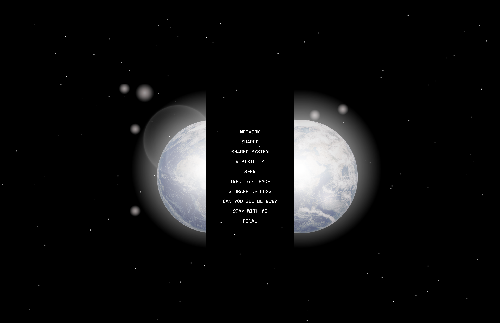
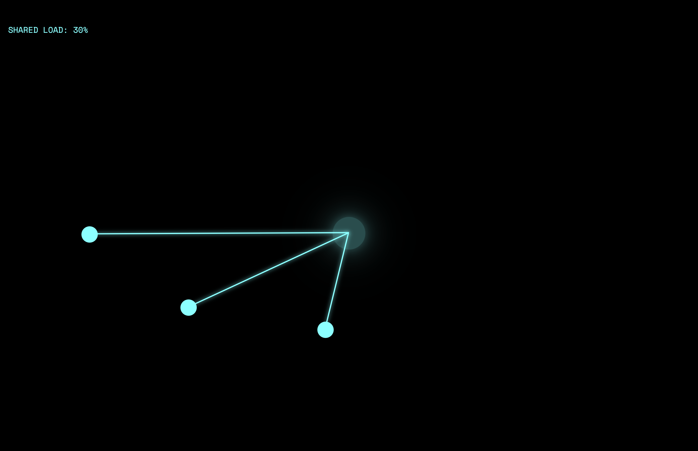
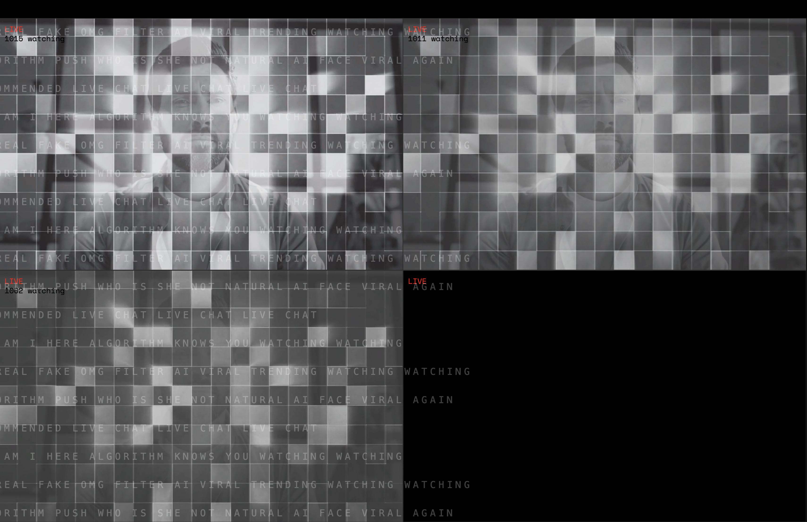
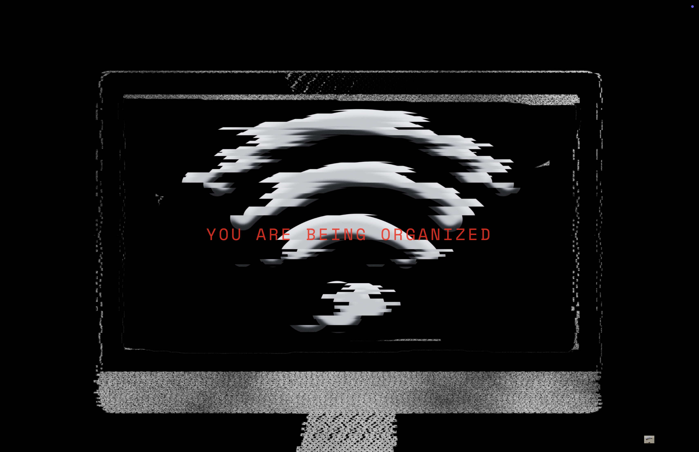
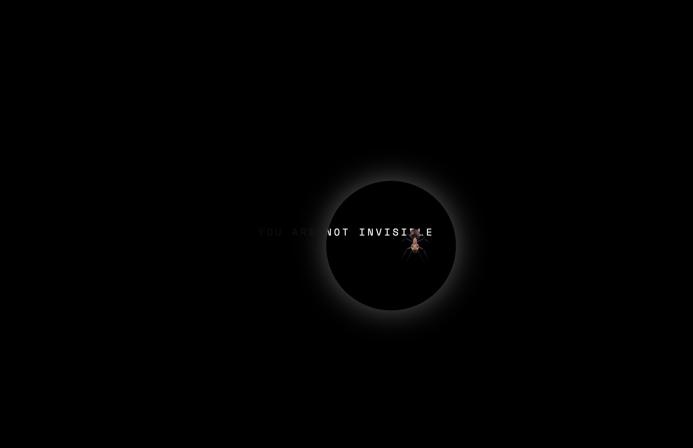
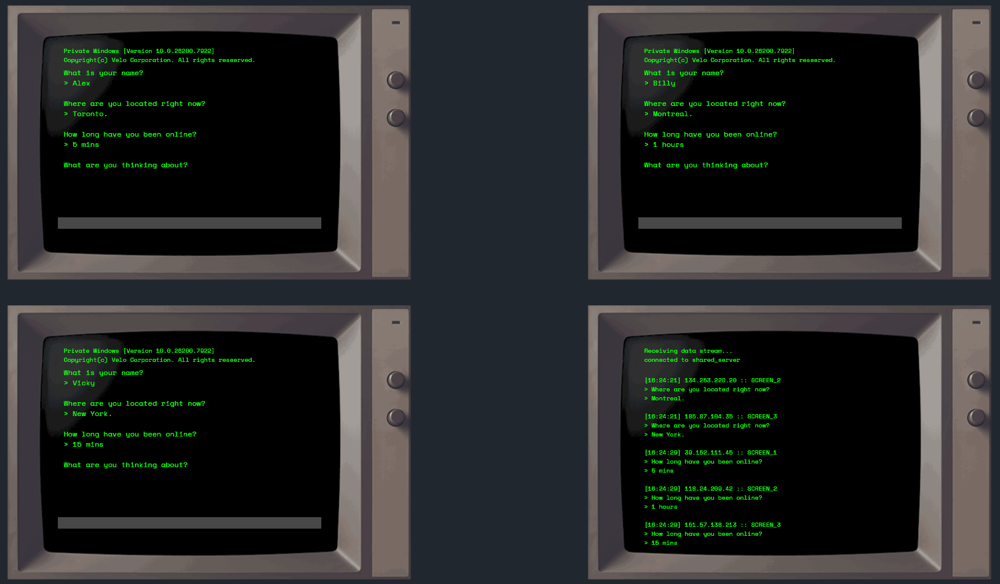
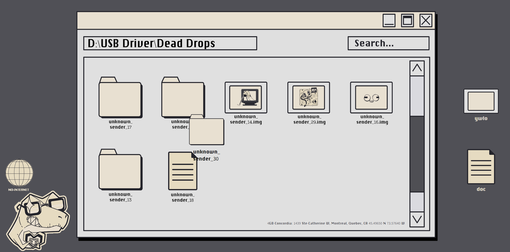
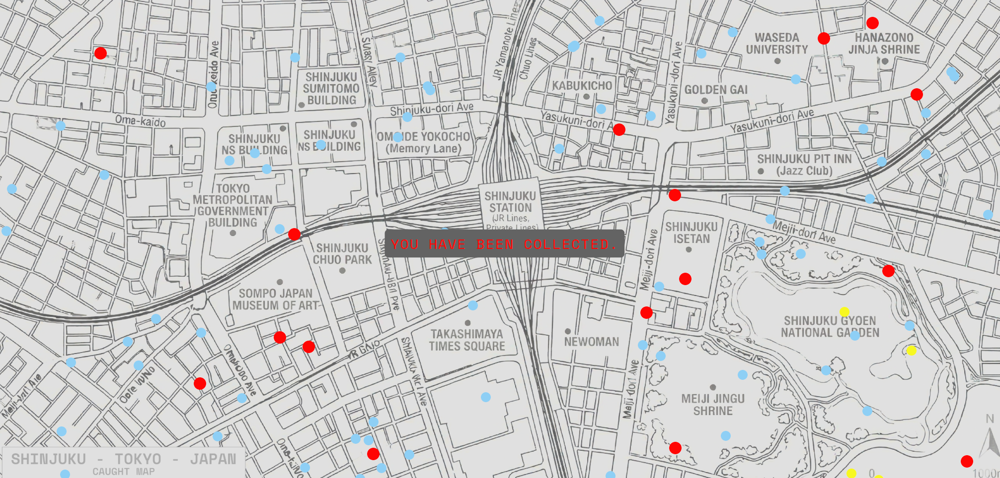
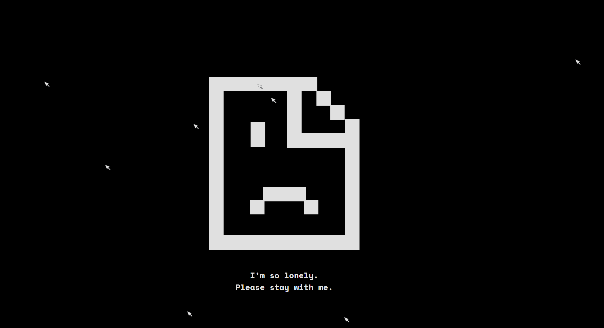

# CART-263-PROJECT-I
Cart 263 project I
- Team work : Xueyi Xia, Weini Wang
- github live link：https://bbwinnie.github.io/CART-263-PROJECT-I/
- github repositories link：https://github.com/bbwinnie/CART-263-PROJECT-I.git

# Interactive Web Project
Project Overview
This project reflects on the paradox of shared networks: while the internet promises connection and sharing, it also constantly records, transmits, and exposes our digital traces, making it a space where true secrecy rarely exists.

# Structure of the Project
The project consists of ten interconnected webpages:

# Xueyi Part:
1. EARTH
- Through a carve up Earth image， users enter the system. Clicking causes the image to split and move to both sides.

2. Shared
- Every time a node is clicked the "shared load" increases,symbolizing how individual actions are continuously absorbed into a larger digital structure.

3. shared.system
- For simultaneous "television live" panels are in motion.The watching number of people continues to increase but this increase is system made suggesting that visibility itself is a constructed state.

4. Visibility 
- Following consumer behavior changes, the tableau gradually produces an unstable and out of control result. Finally entering a collapse state. This end suuggests that within algorithmic structures individual control may gradually weaken or even disappear.

5. Seen
- Through a spotlight effect that follows mouse movenment , individuats  can gradually find hidden scripts and bugs. In this explore process ,consumers become conscious that they become both an observer and someone who is being watched. 

# Weini part:
6.Input or Trace
- Users are asked to answer a series of questions, and their responses appear on a log screen. This represents how anything typed or entered online leaves a trace and can be recorded somewhere in a system. If the user does not answer the questions, fake users will automatically respond instead. This suggests that online spaces are constantly producing data and traces, even without direct participation.

7.Storage or Loss
-This interaction is inspired by the Dead Drops project. When users save a document into the local drive, the file name automatically changes to “user,” representing how individual identity can be replaced within shared systems. When a new file is added, the system deletes older or unused files. This reflects how, on the internet, data can be stored and shared by anyone, but older or less relevant data is constantly replaced or lost.

8.Can you see me now?
-This interaction is inspired by Can You See Me Now?, one of the earliest location-based games. The interface recreates a simplified map where simulated users move across the space, referencing the original gameplay that took place in Shinjuku, Tokyo. Blue dots represent players, red dots represent players who have already been seen, and yellow dots are players that the user can click to “catch,” revealing their final coordinates. The work reflects how, since the early 2000s, digital systems have increasingly collected and tracked personal location data, suggesting that in a shared networked world, true privacy may no longer exist.

9.Stay with me
-This interaction is inspired by Jonas Lund’s work We See in Every Direction. In the original project, multiple users browse the web together on the same interface, revealing how people interact and search on a shared device or system. In my version, when the user clicks the emoji, additional cursors appear, representing other users entering the same space; once there are many users online, the emoji is no longer alone. This reflects how online platforms and AI systems collect user data and bring multiple participants into a shared digital environment.

10.No offline
-This page represents the conclusion of the project. The Earth symbolizes how we all exist within the same shared internet, just as we share the same planet. When the user clicks the Earth, it closes and moves to the bottom-right corner, suggesting that data never truly disappears but remains somewhere in the system. The small Earth can be clicked again to return to the main page, reinforcing the idea of a continuous and interconnected network.

# References:
Blast Theory. *Can You See Me Now?* (2003)
https://www.blasttheory.co.uk/projects/can-you-see-me-now/

Bartholl, Aram. *Dead Drops* (2010)
https://deaddrops.com/

Lund, Jonas. We See In Every Direction (2013).
https://jonaslund.com/works/we-see-in-every-direction/

Bucher, Taina. “The Algorithmic Imaginary: Exploring the Ordinary Affects of Facebook Algorithms.”
Information, Communication & Society, 2017.
https://doi.org/10.1080/1369118X.2016.1154086

Maiberg, Emanuel. “This Website Will Self Destruct If You Stop Posting.” 
VICE, April 21, 2020. 
https://www.vice.com/en/article/this-website-will-self-destruct-if-you-stop-posting/

